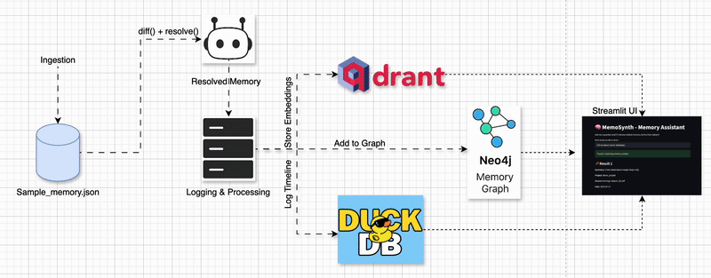
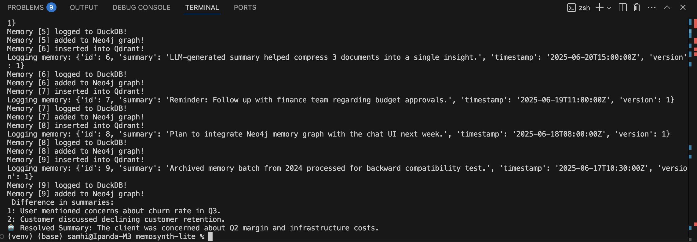
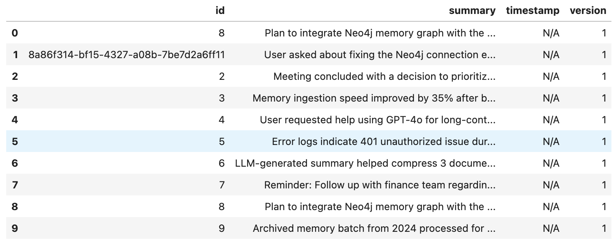

# Memosynth Lite

Memosynth Lite is a lightweight memory ingestion and storage pipeline designed to process JSON-based memory logs, perform summarization and deduplication, and store enriched outputs into three types of backends: a vector database (Qdrant), a relational timeline log (DuckDB), and a memory graph (Neo4j).

---

## 📊 Project Architecture

Here’s a high-level visual overview of the memory processing pipeline:


<!-- If using the GIF version instead -->
<!--  -->

<details>
<summary>📄 Text-Based Flow (Click to Expand)</summary>
```text
           +---------------------+
           |  sample memory.json |
           +---------------------+
                     |
              Ingestion Phase
                     |
                     v
           +---------------------+
           |     Memosynth Bot   |
           | (diff + resolve fn) |
           +---------------------+
                     |
            Logging & Processing
                     v
         +---------------------------+
         |  Vector Embedding Storage |
         |         (Qdrant)         |
         +---------------------------+
                     |
         +---------------------------+
         |    Timeline Logs (DuckDB) |
         +---------------------------+
                     |
         +---------------------------+
         |    Memory Graph (Neo4j)   |
         +---------------------------+
```

### Explanation:

* **sample memory.json**: Source file containing memory entries in JSON format.
* **diff() + resolve()**: Custom logic to detect changes and resolve memory overlap, producing a single summary.
* **Logging & Processing**: All memory entries are processed, logged, and sent to three types of persistent storage:

  * **Qdrant**: For semantic vector search and similarity queries
  * **DuckDB**: For timeline-based querying and chronological inspection
  * **Neo4j**: For storing entities and relationships across memory entries

---

## 📁 Repository Structure and File Explanations

### 1. `memory_client.py`

* **Purpose**: Orchestrates the ingestion and processing pipeline.
* **Key Functions**:

  * `create_collection()`: Initializes the Qdrant collection.
  * `init_timeline_table()`: Initializes the DuckDB timeline log table.
  * `load_memory_and_insert()`: Main ingestion function that performs:

    * Parsing of memory
    * Resolving via `diff()` and `resolve()`
    * Insertion into Qdrant, DuckDB, Neo4j

### 2. `timeline_store.py`

* **Purpose**: Handles interaction with DuckDB (local columnar database).
* **Key Functions**:

  * `init_timeline_table()`: Creates `memory_log` table in `memory_timeline.db`.
  * `log_memory()`: Inserts resolved memory entries into DuckDB.
  * `read_timeline()`: Fetches memory logs for timeline viewing.

### 3. `vector_store.py`

* **Purpose**: Integrates Qdrant for storing semantic memory as vector embeddings.
* **Key Functions**:

  * `create_collection()`: Creates collection in Qdrant.
  * `insert_memory()`: Adds resolved memory into Qdrant.

### 4. `graph_store.py`

* **Purpose**: Integrates Neo4j for graph storage.
* **Key Functions**:

  * `add_memory_node()`: Adds memory as a node in the Neo4j graph.

### 5. `sample_memory.json`

* **Purpose**: Sample dataset used for testing the ingestion process.
* **Structure**:

```json
{
  "id": 1,
  "summary": "Client asked about margin drop in Q2.",
  "source": "Earnings_Report_Q2.pdf",
  "tags": ["finance", "Q2", "risk"],
  "type": "insight",
  "timestamp": "2025-06-19T12:00:00Z"
}
```

### 6. `test_memory.ipynb`

* **Purpose**: Jupyter notebook to test and validate ingestion.
* **Actions Performed**:

  * Testing `diff()` and `resolve()`
  * Running `load_memory_and_insert()`
  * Checking contents of DuckDB using `read_timeline()`

---

## 🚀 How to Run the Project

1. **Set up your environment:**

```bash
python3 -m venv venv
source venv/bin/activate
pip install -r requirements.txt
```

2. **Start Qdrant (if running locally):**

```bash
docker run -p 6333:6333 qdrant/qdrant
```

3. **Start Neo4j (if running locally):**

```bash
docker run \
  --publish=7474:7474 --publish=7687:7687 \
  --env NEO4J_AUTH=neo4j/test \
  neo4j:latest
```

4. **Run the pipeline:**

```bash
python -m memosynth.memory_client
```

5. **Query Qdrant to check insertion:**

```bash
curl http://localhost:6333/collections/memory_collection/points/scroll -X POST -H "Content-Type: application/json" -d '{"limit": 10}'
```

6. **(Optional) Use Jupyter notebook for timeline check:**

```bash
jupyter notebook test_memory.ipynb
```

---

## ✅ Sample Output (Ingestion Logs + Timeline View)

Below are sample screenshots of the system running successfully:

### 📟 Memory Ingestion Logging

Shows memories being inserted into Qdrant, DuckDB, and Neo4j in real time via the terminal:



---

### 📊 DuckDB Timeline View

Memories logged to the local DuckDB timeline database:




## 🔗 Dependencies

* `qdrant-client`
* `duckdb`
* `neo4j`
* `pandas`, `uuid`, `json`, `datetime`

---

## 🌟 Outcome

This project demonstrates how to create a mini memory system that logs, deduplicates, and stores information across three complementary storage layers:

* **Semantic Search** (Qdrant)
* **Relational Logs** (DuckDB)
* **Entity Graphs** (Neo4j)

It can be extended to handle multimodal inputs, complex timelines, and cross-memory reasoning systems.
